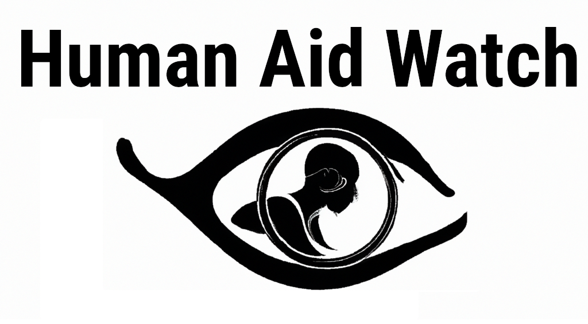

# Human Aid Watch (HAW)

## Overview

Human Aid Watch (HAW) is a platform designed to monitor and ensure the transparent distribution of humanitarian aid. In a world where aid is often misallocated or misused, HAW aims to bring accountability and transparency to the process. By leveraging technology and community participation, we strive to make sure that aid reaches its intended beneficiaries.



## Features

- **Real-Time Monitoring**: Observers on the ground can submit real-time data about aid distribution.
  
- **Geolocation**: Each submission is geotagged to provide precise information about where aid is being distributed.
  
- **Multi-Media Support**: Observers can upload photos and videos as evidence to support their reports.
  
- **User Authentication**: Secure login features ensure that only authorized personnel can submit and review reports.

- **Data Analytics**: Advanced analytics tools to evaluate the effectiveness of aid distribution.

## Technology Stack

- **Frontend**: Streamlit
- **Backend**: SQLite for database, Python for server-side logic
- **Deployment**: Streamlit Cloud

## How to Install

1. Clone the repository
    ```
    git clone https://github.com/najibmo/HumanAidWatch.git
    ```
2. Navigate to the project directory
    ```
    cd HumanAidWatch
    ```
3. Install the required packages
    ```
    pip install -r requirements.txt
    ```
4. Run the Streamlit app
    ```
    streamlit run app.py
    ```

## Contributing

We welcome contributions from the community. If you'd like to contribute, please fork the repository and make changes as you'd like. Pull requests are warmly welcome.

## License

This project is licensed under the MIT License - see the [LICENSE.md](LICENSE.md) file for details.

## Contact

For more information, feel free to reach out to us at [info@humanaidwatch.org](mailto:info@humanaidwatch.org).
